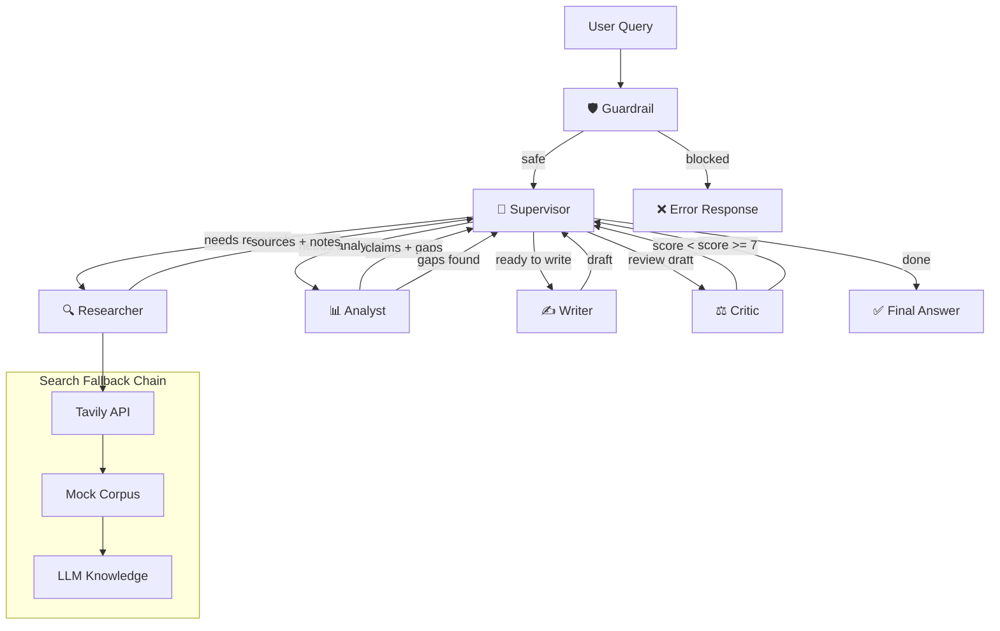

# Multi-Agent Research Lab

> **Lab 20 — Production-grade multi-agent research system** comparing single-agent vs multi-agent workflows.

## Architecture Diagram



## Fallback Strategy ⚠️

### LLM Fallback
- **Primary**: OpenAI (gpt-4o-mini) for all agents
- **Retry**: 3 attempts with exponential backoff (1s → 2s → 4s)
- **Timeout**: 30s per call, 120s end-to-end workflow
- **Friendly error**: If all retries fail, state.error is set and workflow terminates gracefully

### Search Fallback (3-tier)
1. **Tavily API** — real-time web search (if `TAVILY_API_KEY` set)
2. **Mock data** — keyword matching against `graphrag_corpus.json` (12 curated docs)
3. **Direct LLM** — training knowledge with `[unverified]` markers

## Guardrails
- **Pre-filter classifier**: safe / sensitive / out_of_scope / policy_violation
- **Max iterations**: 8 (configurable in `configs/lab_default.yaml`)
- **Max research loops**: 2
- **Cost cap**: $0.50 per run
- **Timeout**: 120s end-to-end

## Agent Responsibilities

| Agent | Model | Role |
|-------|-------|------|
| Guardrail | gpt-4o-mini | Input classification (1 call) |
| Supervisor | gpt-4o-mini | Routing decisions (deterministic rules + LLM fallback) |
| Researcher | gpt-4o-mini | Query decomposition + search + note synthesis |
| Analyst | gpt-4o-mini | Claim extraction + gap analysis + confidence scoring |
| Writer | gpt-4o-mini | Final answer with citations |
| Critic (bonus) | gpt-4o-mini | 4-axis quality review + revision request |

## Quickstart

```bash
# Setup
python -m venv .venv && source .venv/bin/activate
pip install -e ".[dev,llm]"
cp .env.example .env    # add your OPENAI_API_KEY

# Test
pytest tests/ -v

# Run
python -m multi_agent_research_lab.cli routes              # show endpoints
python -m multi_agent_research_lab.cli baseline -q "What is GraphRAG?"
python -m multi_agent_research_lab.cli multi-agent -q "Compare GraphRAG vs RAG" --critic
python -m multi_agent_research_lab.cli benchmark           # run full benchmark
python -m multi_agent_research_lab.cli serve               # start FastAPI server
```

## API Endpoints

| Method | Path | Description |
|--------|------|-------------|
| POST | `/run/baseline` | Run single-agent baseline |
| POST | `/run/multi-agent` | Run multi-agent workflow |
| POST | `/benchmark/run` | Run benchmark comparison |
| GET | `/benchmark/{id}` | Get benchmark results |
| GET | `/trace/{run_id}` | Get run trace/planning log |
| GET | `/health` | Liveness check |
| GET | `/docs` | Swagger UI |

## Extra Features (Bonus)

- [x] Guardrail agent with classification pre-filter
- [x] Critic agent with 4-axis rubric + revision loop
- [x] LLM-as-judge benchmark automation
- [x] FastAPI + CLI dual interface
- [x] Cost tracking + VND conversion
- [x] Mock search fallback chain (3-tier)
- [x] Cross-provider LLM retry with exponential backoff
- [x] Rich console logging with agent-level color coding
- [x] Planning log persistence (JSONL)
- [x] Structured routing with deterministic rules (saves LLM cost)
- [x] Self-correction loop (Analyst → Researcher gap-filling)

## Demo Flow

```bash
# 1. Show routes
python -m multi_agent_research_lab.cli routes

# 2. Single-agent baseline
python -m multi_agent_research_lab.cli baseline -q "Who founded Anthropic?"

# 3. Multi-agent with critic + self-correction loop
python -m multi_agent_research_lab.cli multi-agent \
  -q "Research GraphRAG state-of-the-art, compare with traditional RAG, 500 words" \
  --critic

# 4. Full benchmark
python -m multi_agent_research_lab.cli benchmark

# 5. API demo
python -m multi_agent_research_lab.cli serve  # terminal 1
curl -X POST http://localhost:8000/run/baseline \
  -H "Content-Type: application/json" \
  -d '{"query": "What is GraphRAG?"}'
```

## Project Structure

```text
src/multi_agent_research_lab/
├── agents/               # Agent implementations
│   ├── prompts/          # Markdown prompt templates (A/B testable)
│   ├── base.py           # BaseAgent + prompt loader
│   ├── guardrail.py      # Input safety filter
│   ├── supervisor.py     # Orchestrator with deterministic routing
│   ├── researcher.py     # Search + synthesis
│   ├── analyst.py        # Claim extraction + gap analysis
│   ├── writer.py         # Final answer generation
│   └── critic.py         # Quality review (bonus)
├── core/                 # Shared types and config
│   ├── config.py         # Pydantic Settings from .env
│   ├── state.py          # ResearchState (single source of truth)
│   ├── schemas.py        # All Pydantic models
│   ├── errors.py         # Domain errors
│   └── pricing.py        # Token cost calculator
├── graph/                # Workflow orchestration
│   ├── workflow.py       # Multi-agent workflow
│   └── baseline.py       # Single-agent baseline
├── services/             # External service clients
│   ├── llm_client.py     # OpenAI with retry + fallback
│   ├── search_client.py  # 3-tier search fallback
│   ├── storage.py        # Local artifact storage
│   ├── mock_data/        # Curated research corpus
│   └── api/              # FastAPI application
├── evaluation/           # Benchmark + quality metrics
│   ├── benchmark.py      # Benchmark runner
│   ├── judge.py          # LLM-as-judge (bonus)
│   ├── metrics.py        # 5 mandatory metrics
│   ├── queries.yaml      # 3-tier query sets
│   └── report.py         # Markdown report generator
├── observability/        # Logging + tracing
│   ├── logging.py        # Rich console with agent colors
│   ├── tracing.py        # Span context manager
│   └── planning_log.py   # JSONL persistence
└── cli.py                # Typer CLI entrypoint
```
